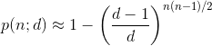

duplex - Interactively delete duplicate files
=============================================

A interactive duplicate file removal utility that can handle arbitrarily sized folders and allows setting up rules for which files to delete. Rules can be specified while viewing groups of duplicates in an interactive session or passed on the command line and run automatically.

Usage
-----

Use the ``--folder`` and ``--rfolder`` options to add folders to search for duplicates. Use each option as many times as necessary to add different folder hierarchies that should be checked for duplicates. The app collects files from all the provided folder hierarchies then searches the collection for duplicates.

After searching for duplicates, the app will (by default) enter its interactive mode to allow setting up rules to select duplicates to delete. See `Interactive mode commands`_ and `Example`_ below. Alternatively, the ``--rule`` option can be used to add rules on the command line and the rules can be executed automatically with ``--automatic``.

In the interactive session, mark individual files for deletion by their index numbers and general files by regular expressions.

When done marking files, run the ``delete`` command to delete the marked files. The app deletes the marked files, updates the statistics (viewable with ``status``), deletes the applied rules after which it goes back to interactive mode if there are still undeleted duplicates.

A group is a list of duplicates. The app will not delete all the duplicates in a group. This ensures that at least one copy of any file that has duplicates is retained. This is accomplished by not applying a rule to the last file in a group if applying the rule would cause all the files in the group to be deleted.

One or more list of files that have had their MD5 hashes calculated previously can be included in the search for duplicates by using the ``--md5list`` option. The format of the file must like the one generated by the md5deep -zr command. When ``--md5list`` is used, ``--md5`` is automatically enabled.

Command line
~~~~~~~~~~~~

::

    Duplex - Delete duplicate files - dahlsys.com:
      -h [ --help ]             produce help message
      -d [ --dry-run ]          don't delete anything, just simulate
      -a [ --automatic ]        don't enter interactive mode (delete without 
                                confirmation)
      -s [ --filter-small ] arg ignore files of this size and smaller
      -b [ --filter-large ] arg ignore files of this size and larger
      -q [ --quiet ]            display only error messages
      -v [ --verbose ]          display verbose messages
      -e [ --debug ]            display debug / optimization info
      -5 [ --md5 ]              use md5 cryptographic hash (fnv 64 bit hash is used
                                by default)
      -u [ --rule ] arg         add marking rule (case insensitive regex)
      -r [ --rfolder ] arg      add recursive search folder
      -m [ --md5list ] arg      add md5 list file (output from md5deep -zr)
      -f [ --folder ] arg       add search folder

Interactive mode commands
~~~~~~~~~~~~~~~~~~~~~~~~~

::

    <Enter>         go to next group
    f (first)       go to first group
    l (last)        go to last group
    p (previous)    go to previous group
    regex string    add rule to delete all files in all groups matching the regex
    index number    add rule to delete the single file with given index in the group
    d (index)       remove rule
    h, help, ?      display this message
    exit            exit program without deleting anything
    delete          prompt, then delete all marked files

Example
~~~~~~~

Example view of a group of 3 duplicates. One regex rule selecting any file containing the string ``orig`` and one
 path rule, selecting the specific file ``tmp/edit.tmp`` have been added. Stars show the files marked for deletion
 by the current rules. The prompt shows that this is group 5 of 6.

::

   Rules:
               orig
               tmp/edit.tmp

    Duplicates:
         *   1 bitjam/cue/fixed/bitjam_14_fix.cue
             2 bitjam/cue/orig/bitjam_14.cue
         *   3 tmp/edit.tmp

        12,868 bytes per file, all with hash b6584a3a688c6540
        38,604 bytes in group
        25,736 bytes in duplicates
        25,736 bytes in marked files

    Total:
            13 files
             6 groups
             7 duplicates
             0 marked files
        33,399 bytes in all groups
        16,719 bytes in duplicates
             0 bytes in all marked files
          2.17 files per group (average)

    5 / 6 >

Building
--------

Linux
~~~~~

    $ git clone https://github.com/gabime/spdlog.git libraries/linux/spdlog
    $ cd libraries/linux/spdlog && mkdir build && cd build && cmake .. && make -j

Windows
~~~~~~~

Grab the executable from the GitHub Releases page.

Implementation
--------------

Strategy
~~~~~~~~

* Scan all folders provided by user and store file info sorted and grouped by size.

* Remove from consideration all files that have unique sizes (they can't have duplicates).

* Calculate hashes for remaining files and group them by hash.

* Remove all groups that have only one member (they can't have duplicates).

* Enter interactive mode which allows user to view groups of duplicates and specify rules for which files to delete.

Avoiding false duplicates
~~~~~~~~~~~~~~~~~~~~~~~~~

A challenge with an app that searches through folder hierarchies is to avoid searching the same locations multiple times. With an app that detects and deletes duplicates it is especially important to address this potential issue since, if the app was to find the same file multiple times, it would list those hits as duplicates. Deleting one of the "duplicates" would then cause the only copy of the file to be deleted.

The risk of this happening was mitigated in the following ways:

* Though the ``--folder`` and ``--rfolder`` options allow specifying relative paths, the app internally handles all files with absolute paths. Whenever a file is to be added to a group of duplicates, the app checks if the absolute path of the file is already in the group. If the file is already in the group, it is skipped and, if ``--verbose`` has been specified, a warning is printed.

* If the user specifies two folder hierarchies where one has its root within the other, such as in ``--rfolder /home/someuser --rfolder /home``, the app will add files found in the ``*/home/someuser*`` hierarchy only the first time they are encountered.

* To avoid the possibility of a single file being processed under different absolute paths, the app does not follow symbolic links on Windows or Linux, or Folder Junctions on Windows.

The birthday paradox
~~~~~~~~~~~~~~~~~~~~

Briefly, the birthday paradox is that in a group of 23 people, there is a 50% chance that two of them share the same birthday. This is counter intuitive for most people since there are 365 possible birthdays.

The implications of this were considered when deciding to base the detection of duplicates on file hashes. From Wikipedia:

given n random integers drawn from a discrete uniform distribution with range [1,d], what is the probability p(n;d) that at least two numbers are the same?

Plugging in the numbers for 1,000,000 files and a 32 bit hash yields a 100% probability of collisions. 100,000 files gives a 69% probability. In the app, the file size is added to the hash to get some more entropy, but since file sizes are not necessarily non-uniform, yielding small groups of files with the same size, a 32 bit hash is obviously out of the question.

Repeating the exercise for 1,000,000 files and 64 bit hash yields a 0.0000027% probability. That is in the worst case scenario of all 1,000,000 files having the same size. That seemed good enough, so a fast 64 bit hash called FNV1a was selected as the default option. However, an MD5 mode that can be enabled with the ``--md5`` option was also implemented. MD5 is a 128 bit hash, which yields a 1.46e-25 probability of collisions. That number is so low that the formula could not be evaluated with regular double precision floats. An arbitrary-precision library and 40 digits of precision had to be used.

Performance
~~~~~~~~~~~

On a high end PC anno 2010, the app is disk bound when using FNV1a hashes and CPU bound when using MD5 hashes.

The initial implementation ran hash calculations on the files as they were arranged in the internal structures of the app, where the primary ordering is by size. That caused a lot of skipping around on the disk, slowing down calculations on small files. That was fixed by adding a separate ordering step for the calculations, where the files are ordered by their paths.

The FNV1a 64 bit hash does one 64 bit multiplication and one 8/64 bit EOR for each byte of input. 64 bit multiplications are fast on modern 64 bit CPUs but are slow on old 32 bit CPUs (where they must be emulated and 32 bit multiplications are slow to begin with).

Memory usage
~~~~~~~~~~~~

The application caches file metadata in memory so the limiting factor as to how many files can be processed is how much memory is available. The information stored for each file is absolute path, size and hash. In addition, there is overhead in the structures themselves (linked lists and hash maps) and in the granularity of memory allocations performed by objects that dynamically allocate their memory such as std::wstring and boost::filesystem::wpath. Wide (Unicode) characters are used throughout. A test was run on a hierarchy with the following characteristics:

* Number of files: 331,808 * Average path length: 105 characters (210 bytes)

The memory usage was 143,654,912 bytes, which gives 433 bytes of metadata per file and 2,479,773 files per GiB.

If any of that memory gets swapped out to a virtual memory pagefile, performance of the app will probably decline dramatically as the internal structures are not traversed linearly.

Technologies
------------

* C++
* Boost
* fmt
* spdlog
* Fowler–Noll–Vo (FNV) hash
* MD5 hash

Todo
----

Implement more rule types for selecting files to delete:

* Delete all but specific file in group. * Delete all but shortest filename in group. * Delete all but shortest filename in all groups. * Delete all but longest filename in group. * Delete all but longest filename in all groups. * Delete all but shortest pathname in group. * Delete all but shortest pathname in all groups. * Delete all but longest pathname in group. * Delete all but longest pathname in all groups.
